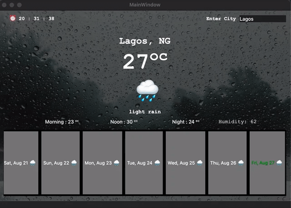

## How to Build
* Download [QT Framework (Version 6.1.2)](https://www.qt.io/download) for your platform. Select the Open source installer. 
	* Select Qt version 6.1.2 during the installation process.  
> For linux OS, make sure your system is up to date by running 
> * sudo apt-get update
> * sudp apt-get install g++
Be sure to complete these two before running the installation process. 
* Clone the Repository to your local machine. 
* Open the Qt Creator, select file -> open project
	* navigate to the directory of this project and select QuickWeather.pro file to open the projec in the editor.
	* navigate to `Headers/globals/Constants.h` and paste the obtained API key in the empty string assigned to the `const QString API_KEY`
	#### Running The Application
	##### Build Tool: qmake and make
	
* After building the project, you can run the app using the Qt Creator Run icon ▶️
* Or on your terminal you can run 
 > qmake QuickWeather.pro, then run
 > make
 > Run the generated QuickWeather executable. 
 
 ## Project Description

 QuickWeather is an application that displays some relevant weather information about place entered by the application user. 
 ### Requirements: 
 * Internet => The Application fetch the weather information from a remote server so internet is required for the application to work. 
 * Qt Framework => As described above, you will need to follow the setup above to run the application locally. 
 
 ### Architecture
 The Project is built using the [Model View Presenter(MVP)](https://en.wikipedia.org/wiki/Model%E2%80%93view%E2%80%93presenter) Architecture. 
 #### Project Files Description
 * **globals/** => Contains all global files like Constants and Util files.
	 * **apputil.h**  => Provides Calculation Utilities such as temperature converstion.
	 * **Constants.h** => Contains the _API_KEY_ global constant field and other constant fields like _SEARCHED_PLACE_TEXT_FILE_ for storing the file name of last searched place. 
	 * **Logger.h**=> An overloaded template `struct` that provides information Logging flexibilty, classified into `debug`, `warning` and `error`.
	 * **UrlBuilder.h**=> Helps to build the url path for getting the weather information for the entered place. 
	 
* **models/** => Contains all the App models used to represent different information as required. 
	* **City.h** => Represent the Searched Location information, such as City name, country and timezone. 
	* **WeatherObject.h** => This contains the weather information about the searched place such as Temperature and other weather contents like icon and description. 
	* **WeatherObjectResponse.h** => This is a composition of City object and WeatherObject. Aggrigating both to a single object. 
* **parser/** => Contains file for parsing the obtained QJsonObject to usable WeatherObjectResponse. 
	* **jsonobjectparser.h** => Every Model object has a mechanism for parsing it from QJsonObject, JsonObjectParser `struct` parses the obtained QJsonObject from the server to WeatherObjectResponse object. 
* **ui/** => The UI provides the mechanism for displaying the weather information to the user of QuickWeather app.
	[Remember the Architecture](https://en.wikipedia.org/wiki/Model%E2%80%93view%E2%80%93presenter) 
	* **WeatherSummaryView.h** => An abstraction that represents behavior of the UI. 
	*  **mainwindow.h, mainwindow.cpp** => This is an implementation of the WeatherSummaryView's pure virtual functions. It send events to the view presenter, that is _WeatherSummaryPresenter_ and display the result of processed event. An example of event is place search.
	* **_NetworkReplyDeleteDelegate_** => This is a templated class used for cleaning the `QNetworkReplay*`. From [QFrameWork Documentation](https://doc.qt.io/qt-5/qnetworkreply.html), developers are responsible for cleaning up the `QNetworkReplay*`. 
	* **weathersummarypresenter.h, weathersummarypresenter.cpp** => Performs the UI logics such as
		* Saving last searched location
		* Provides logic for processing selected day so the information can be displayed as main. 
	* **mainwindow.ui**=> This is a form editor. Used for static design of the applicaiton user interface. 
* **_main.cpp_** => This is the entry point to the QT application. 
